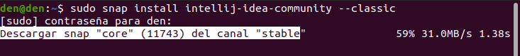
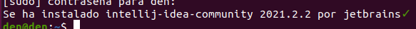

# Instalación de IntelliJ IDEA en Ubuntu 20.04
**Índice**

1. [Introducción](#1)
2. [Instalación de IntelliJ IDEA](#2)
3. [Ejecutar IntelliJ IDEA](#3)

## Introducción<a name="1"></a>
Es un entorno de desarrollo integrado usado principalmente para el desarrollo de programas normalmente en Java como muchos otros IDE’s como lo son Visual Studio Code, NetBeans, pero también se trabaja con otros lenguajes como JavaScript, PHP, SQL entre otros.
## Instalación de IntelliJ IDEA<a name="2"></a>
Empezaremos con un único comando que tendremos que utilizar para descargar IntelliJ.

```
sudo snap install intellij-idea-community --classic
```
<div align="center">
 

 
</div>

Una vez haya terminado la descarga nos aparecerá un mensaje indicándonos que el IDE ya está instalado.

<div align="center">
 

 
</div>

## Ejecutar IntelliJ IDEA<a name="3"></a>
Buscaremos desde el cajón de aplicaciones por el icono de IntelliJ, que será como este:

<div align="center">
 

 
</div>

Al ejecutarlo tardará un poco al ser la primera vez y nos saltará directamente con los permisos de licencia y políticas.

<div align="center">
 

 
</div>

Una vez aceptado los términos, nos aparecerá otro apartado donde nos preguntará si queremos enviar información de uso anónimamente, en mi caso seleccioné no enviar dicha información, aunque también se puede aceptar y no enviará ningún tipo de información personal.

<div align="center">
 

 
</div>

Con esto comenzará a iniciarse como tal el programa y tomará varios segundos.

<div align="center">
 

 
</div>

Finalmente una vez termine de iniciarse, veremos una interfaz muy similar a la siguiente, por lo tanto ya podríamos empezar a trabajar en nuestros proyectos.

<div align="center">
 

 
</div>
